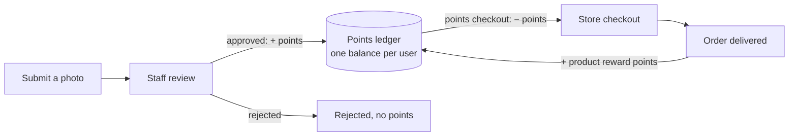

# Green Arcade — Product Requirements Document (MVP)

Version 0.1 (draft) · 2026-10-01

## 1. Product overview

Green Arcade MVP lets people earn points for verified sustainable actions and spend them in Row-Cycle's store, all in one responsive web app. It is both a marketplace and an awareness platform, tied together by a single points ledger.

**Product goals for the MVP**

1. A user can go from sign-up to a first approved submission and a first store order.
2. Staff can run moderation, catalog and orders without touching the database.
3. Every points movement is traceable to its source (submission, order, admin adjustment).

Business context, scope and open questions are in BRD.md.

## 2. User roles

| Role | Can do |
| --- | --- |
| Guest | Browse the store catalog; sign up; log in |
| Member | Everything a guest can, plus: submit actions, earn points and badges, add to cart, check out, view orders and points history |
| Moderator | Review submissions (approve / reject with a reason) |
| Store manager | Manage products, categories, stock, point prices; process orders |
| Admin | Everything above, plus: manage users and roles, adjust points manually, configure badges and point rules |

## 3. Core loop

Approved actions add points; a points checkout subtracts them; every delivered order (points or cash) adds the products' reward points back. Badges are checked after each approval and each delivered order.

## 4. Feature requirements

Priority: **Must** = needed for the MVP launch, **Should** = in the MVP if time allows.

### F1 — Account and profile (Must)

*As a member, I want an account so my points and badges are saved.*

- Sign up with name, email and password; email verification required before submitting or ordering.
- Log in, log out, forgot / reset password.
- Profile shows name, photo, current points balance, badges earned, and links to points history and orders.
- Member can edit name, photo, phone and default shipping address.

### F2 — Points ledger (Must)

*As a member, I want to see every point I earned or spent and why.*

- Every change is a ledger entry: amount (+/−), type (Earn / Redeem / Reverse / Adjust), source (submission, order, admin), timestamp.
- Balance = sum of entries; it can never go below 0.
- Points history page lists entries newest first, with paging.
- Admin can add or deduct points with a mandatory reason; the entry records who did it.

### F3 — Action submission (Must)

*As a member, I want to photograph a sustainable action and get points once staff approve it.*

- Member picks a category (Can collection, Coastal/lake clean-up, Recycling, Feeding animals, Helping people, Other), uploads or takes one photo (JPG/PNG/WEBP, max 10 MB), adds an optional note.
- For Can collection and Clean-up, the member can enter an estimated weight in kg (used later by the Rotahope tracker).
- Status flow: Pending → Approved or Rejected. Points are written to the ledger only on approval.
- Rejection requires a reason, shown to the member.
- Limit: configurable max submissions per member per day (default proposal: 5).
- Member sees their submissions with status.

### F4 — Badges (Should)

*As a member, I want badges for milestones so progress feels visible.*

- Admin defines badges with a rule: total approved submissions ≥ N, or approved submissions in a category ≥ N, or first order placed.
- Badges are awarded automatically when the rule is met and shown on the profile.

### F5 — Store catalog (Must)

*As a visitor, I want to browse Row-Cycle products.*

- Categories: Medals, Trophies, Recycled-aluminium goods, Branded merch (admin-editable).
- Product: name, description, images, category, EGP price, points price (optional), reward points (default 0), stock, active flag; optional variants (e.g. size).
- When reward points > 0, the product list and detail show "Buy this and earn X points".
- Search by name; filter by category; sort by newest / price.
- Out-of-stock products show but cannot be added to the cart.

### F6 — Cart and checkout (Must)

*As a member, I want to buy products with points or pay on delivery.*

- Cart persists for logged-in members.
- Checkout steps: shipping address → payment method → review → confirm.
- Payment methods in the MVP: **Points** (only for items with a points price, and only if balance covers it) and **Cash on delivery** (pending confirmation — see BRD open questions).
- On confirm: stock is reserved; points are deducted in the same database transaction as the order is created.
- Every order (points or cash) awards the buyer the sum of each item's reward points × quantity when the order is marked Delivered. The order page shows the pending reward until then.

### F7 — Orders (Must)

*As a member, I want to track my orders.*

- Status flow: Placed → Confirmed → Shipped → Delivered, or Cancelled.
- Cancelling an order returns stock and refunds the points of a points order (Reverse entry). No reward points exist to take back, since cancellation is only possible before delivery.
- Member sees order list and order detail with status history.

### F8 — Admin panel (Must)

*As staff, I want to run the platform from a web panel.*

- Dashboard: pending submissions count, new orders count, low-stock products.
- Submissions queue: view photo, approve / reject.
- Products and categories: create, edit, deactivate, upload images, set stock, set reward points.
- Orders: list, filter by status, change status.
- Users: search, view, change role, block, adjust points.
- Settings: points per category, daily submission limit, badges.

## 5. Screens

| Area | Screen | Roles |
| --- | --- | --- |
| Public | Home (store highlights, how points work) | All |
| Public | Login, Sign up, Verify email, Reset password | Guest |
| Store | Product list, Product detail | All |
| Store | Cart, Checkout, Order confirmation | Member |
| Account | Profile, Edit profile | Member |
| Account | Points history | Member |
| Account | My orders, Order detail | Member |
| Actions | New submission, My submissions | Member |
| Admin | Dashboard | Staff |
| Admin | Submissions queue, Submission detail | Moderator, Admin |
| Admin | Products, Product edit, Categories | Store manager, Admin |
| Admin | Orders, Order detail | Store manager, Admin |
| Admin | Users, User detail, Points adjustment | Admin |
| Admin | Settings (point rules, badges) | Admin |

## 6. Non-goals and later releases

The MVP deliberately leaves these out; the data model still keeps room for them.

- **Release 2:** kids' daily challenges, B2B bulk/custom-order form, online card payments, Rotahope wave tracker.
- **Release 3:** recycling map, monthly leaderboard, competitions page, cash donations.
- **Later:** running tracker, athlete posts, rowing-board station, native mobile apps.
- **Removed:** yearly seminar, arcade mini-games (Phase 6).
- **Not planned:** automated (ML) photo verification, multi-vendor selling, Arabic UI (open question: confirm whether Arabic is needed at launch).
