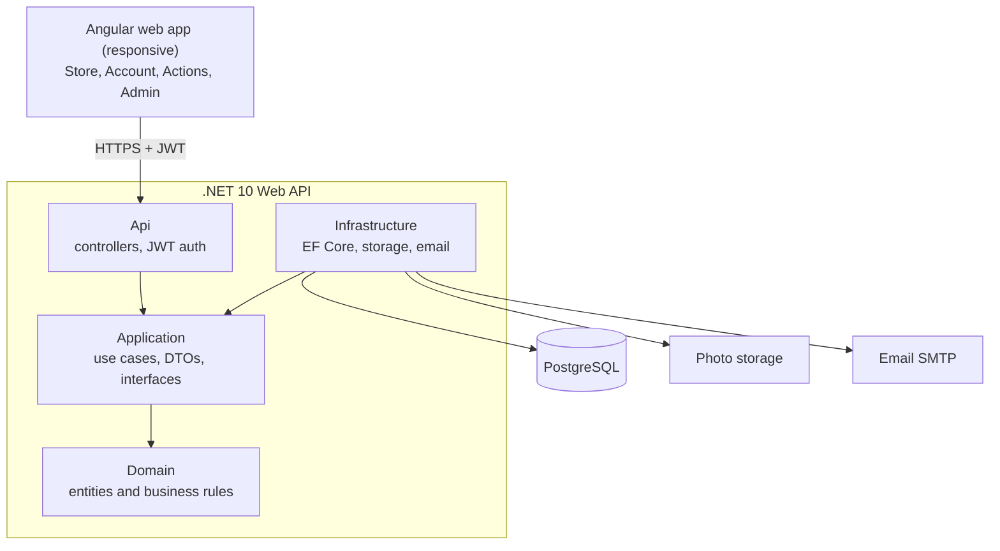

# Green Arcade — Software Requirements Specification (MVP)

Version 0.1 (draft) · 2026-10-01

## 1. Introduction and stack

The MVP is a single Angular web app (member area + admin area) calling one ASP.NET Core Web API backed by PostgreSQL. This SRS covers the scope defined in BRD.md and PRD.md.

| Layer | Choice | Notes |
| --- | --- | --- |
| Frontend | Angular (latest stable), Angular Material or PrimeNG | Responsive, mobile-first; admin area as a lazy-loaded route guarded by role |
| Backend | ASP.NET Core Web API on .NET 10 (LTS) | Clean architecture: Api / Application / Domain / Infrastructure |
| ORM | EF Core + Npgsql provider | Code-first migrations |
| Database | PostgreSQL | One database, `snake_case` naming |
| Auth | ASP.NET Core Identity + JWT access token + refresh token | Roles: Member, Moderator, StoreManager, Admin |
| File storage | Local disk in dev; S3-compatible or Azure Blob in production | Behind an `IFileStorage` interface |
| Email | SMTP provider behind `IEmailSender` | Verification, password reset, order updates |
| Validation | FluentValidation | |
| Logging | Serilog | |
| API docs | OpenAPI (Swagger / Scalar) | |
| Tests | xUnit + Testcontainers (PostgreSQL) | |

## 2. Architecture



Arrows show dependencies: Api and Infrastructure both depend on Application, which depends on Domain. Infrastructure implements the interfaces Application defines (repositories, `IFileStorage`, `IEmailSender`), so Domain and Application never reference EF Core or PostgreSQL.

## 3. Functional requirements

| ID | Requirement | PRD |
| --- | --- | --- |
| FR-01 | System registers a user with unique email; password min 8 chars with a digit and a letter. | F1 |
| FR-02 | System sends a verification email; unverified users cannot submit or check out. | F1 |
| FR-03 | Login returns a JWT (15 min) and a refresh token (7 days, rotated on use). | F1 |
| FR-04 | Password reset works through a one-time emailed token valid for 1 hour. | F1 |
| FR-05 | Every points change inserts one immutable `points_ledger` row; rows are never updated or deleted. | F2 |
| FR-06 | A write that would make the balance negative is rejected. Balance updates take a row lock on the user's balance. | F2 |
| FR-07 | Admin adjustments require a reason and store the admin's user id. | F2 |
| FR-08 | Submission upload accepts JPG/PNG/WEBP up to 10 MB; the server checks file signature, not only extension. | F3 |
| FR-09 | System rejects a submission when the user reached the daily limit (setting, default 5). | F3 |
| FR-10 | Approving a submission sets status, reviewer and time, and writes an Earn ledger row in one transaction. A submission can be approved only once. | F3 |
| FR-11 | Rejecting requires a reason; no ledger row is written. | F3 |
| FR-12 | After each approval or delivered order, the system evaluates badge rules and awards any newly met badge once. | F4 |
| FR-13 | Catalog API supports paging, category filter, name search and sort; only active products are returned to non-staff. | F5 |
| FR-14 | Checkout creates the order, order items, stock decrements, and (for Points) a Redeem ledger row in one transaction; it fails as a whole if stock or balance is insufficient. | F6 |
| FR-15 | Order prices, point prices and reward points are copied onto order items at checkout time. | F6 |
| FR-16 | Order status changes follow Placed → Confirmed → Shipped → Delivered, or → Cancelled from Placed/Confirmed; each change is logged. | F7 |
| FR-17 | Cancelling restores stock; for Points orders it writes a Reverse ledger row. No reward reversal is needed because rewards are only paid on delivery. | F7 |
| FR-18 | Each product has `reward_points` (int ≥ 0). When an order becomes Delivered, the system writes one Earn row of Σ(unit_reward_points × quantity) for both payment methods, in the same transaction as the status change. | F6 |
| FR-19 | Admin endpoints require the matching role; every admin write is audit-logged (who, what, when). | F8 |

## 4. Data model

Identity tables (`asp_net_users`, roles, claims) come from ASP.NET Core Identity. The app adds the tables below. All ids are `uuid`; all times are `timestamptz` in UTC; money is `numeric(12,2)` EGP.

| Table | Key columns | Notes |
| --- | --- | --- |
| `user_profiles` | user_id (PK, FK), full_name, photo_url, phone, points_balance int | Balance is a cache of the ledger sum, updated in the same transaction; `CHECK (points_balance >= 0)` |
| `addresses` | id, user_id, city, area, street, building, notes, is_default | |
| `points_ledger` | id, user_id, amount int, type (earn/redeem/reverse/adjust), source_type, source_id, reason, created_by, created_at | Append-only; index on (user_id, created_at desc) |
| `submission_categories` | id, name, points_reward, tracks_weight bool, is_active | tracks_weight = true for can collection, clean-up |
| `submissions` | id, user_id, category_id, photo_url, note, weight_kg numeric(8,2) null, status, reviewed_by, reviewed_at, reject_reason, created_at | weight_kg feeds the future Rotahope tracker |
| `badges` | id, name, icon_url, rule_type, rule_category_id null, threshold | |
| `user_badges` | user_id, badge_id, awarded_at | PK (user_id, badge_id) |
| `product_categories` | id, name, slug, sort_order, is_active | |
| `products` | id, category_id, name, slug, description, price_egp, price_points int null, reward_points int default 0, is_active, product_type | product_type keeps room for B2B items later; `CHECK (reward_points >= 0)` |
| `product_variants` | id, product_id, name, sku, stock int, price_override null | Every product has at least one variant; `CHECK (stock >= 0)` |
| `product_images` | id, product_id, url, sort_order | |
| `carts` / `cart_items` | cart: id, user_id · item: cart_id, variant_id, quantity | |
| `orders` | id, order_number, user_id, payment_method (points/cod), status, total_egp, total_points, total_reward_points, shipping address snapshot (jsonb), created_at | |
| `order_items` | id, order_id, variant_id, product_name, unit_price_egp, unit_price_points, unit_reward_points, quantity | Snapshot of prices and rewards at checkout |
| `order_status_history` | id, order_id, from_status, to_status, changed_by, changed_at | |
| `settings` | key, value (jsonb) | daily_submission_limit |
| `audit_logs` | id, user_id, action, entity, entity_id, data jsonb, created_at | |

## 5. API endpoints

Base path `/api/v1`. JSON in and out; errors use RFC 7807 Problem Details; lists return `{ items, page, pageSize, total }`.

| Method | Path | Role | Purpose |
| --- | --- | --- | --- |
| POST | /auth/register | Public | Create account |
| POST | /auth/login | Public | Get tokens |
| POST | /auth/refresh | Public | Rotate refresh token |
| POST | /auth/verify-email | Public | Confirm email token |
| POST | /auth/forgot-password, /auth/reset-password | Public | Password reset |
| GET / PUT | /me | Member | Read / update profile |
| GET / POST / PUT / DELETE | /me/addresses | Member | Manage addresses |
| GET | /me/points | Member | Balance + ledger (paged) |
| GET | /me/badges | Member | Earned badges |
| GET | /submission-categories | Member | Categories + points |
| POST | /submissions | Member | Create (multipart: photo + fields) |
| GET | /me/submissions | Member | Own submissions |
| GET | /products, /products/{slug} | Public | Catalog |
| GET | /product-categories | Public | Categories |
| GET / POST / PUT / DELETE | /cart, /cart/items | Member | Cart |
| POST | /orders | Member | Checkout |
| GET | /me/orders, /me/orders/{id} | Member | Order history |
| POST | /me/orders/{id}/cancel | Member | Cancel (Placed only) |
| GET | /admin/dashboard | Staff | Counts |
| GET | /admin/submissions | Moderator | Queue (filter by status) |
| POST | /admin/submissions/{id}/approve, /reject | Moderator | Review |
| CRUD | /admin/products, /admin/product-categories, /admin/products/{id}/images | StoreManager | Catalog |
| GET / PUT | /admin/orders, /admin/orders/{id}/status | StoreManager | Orders |
| GET / PUT | /admin/users, /admin/users/{id}/role, /block | Admin | Users |
| POST | /admin/users/{id}/points-adjustments | Admin | Manual points |
| CRUD | /admin/badges, /admin/submission-categories | Admin | Rules |
| GET / PUT | /admin/settings | Admin | Settings |

## 6. Non-functional requirements

Starting proposals for an MVP; adjust once real traffic is known.

| ID | Area | Requirement |
| --- | --- | --- |
| NFR-01 | Performance | 95% of API reads respond in under 500 ms at 100 concurrent users |
| NFR-02 | Responsiveness | Usable from 360 px width up; Lighthouse mobile performance ≥ 80 on the store pages |
| NFR-03 | Security | HTTPS only; passwords hashed by Identity; JWT signing key in secrets, never in code; rate-limit auth endpoints |
| NFR-04 | Security | Uploaded files get random names, are never executed, and are served from storage, not the API folder |
| NFR-05 | Data integrity | Ledger, stock and order writes run inside one DB transaction; concurrency tested |
| NFR-06 | Availability | 99% monthly uptime target for the MVP |
| NFR-07 | Backup | Daily PostgreSQL backup, kept 14 days; restore tested once before launch |
| NFR-08 | Observability | Structured logs with a correlation id per request; health check at `/health` |
| NFR-09 | Privacy | Personal data limited to name, email, phone, addresses, photos; users can request account deletion |
| NFR-10 | Localization | English UI; text kept in translation files so Arabic (RTL) can be added later |
| NFR-11 | Maintainability | Unit tests for points, checkout and order rules; integration tests against real PostgreSQL |

## 7. Development environment and PostgreSQL

Browse tables with **pgAdmin 4** or **DBeaver** (both free).

1. Run PostgreSQL in Docker: `docker run --name green-arcade-db -e POSTGRES_PASSWORD=dev -p 5432:5432 -d postgres`, or use the PostgreSQL installer (can also install pgAdmin).
2. Connect pgAdmin or DBeaver to `localhost:5432`, user `postgres`.
3. In the API, add `Npgsql.EntityFrameworkCore.PostgreSQL`, then `options.UseNpgsql(connectionString)`.
4. `dotnet ef migrations add Initial` and `dotnet ef database update` work as with SQL Server.

**SQL Server habits that change in PostgreSQL**

| SQL Server | PostgreSQL |
| --- | --- |
| `SELECT TOP 10` | `SELECT … LIMIT 10` |
| `IDENTITY` / `NEWID()` | `GENERATED ALWAYS AS IDENTITY` / `gen_random_uuid()` |
| `[dbo].[Table]` | `public.table`; unquoted names fold to lowercase, so use `snake_case` (EF: `EFCore.NamingConventions`) |
| `datetime2` | `timestamptz` (store UTC) |
| `nvarchar(max)` | `text` |
| Case-insensitive by default | Case-sensitive comparisons; use `ILIKE` or a `citext` column for emails |

**Repository layout**

```
green-arcade/
  RowCycle.slnx
  backend/   src/RowCycle.Api, .Application, .Domain, .Infrastructure · tests/RowCycle.Tests
  frontend/  green-arcade-web (Angular: core/, shared/, features/store, features/account, features/actions, features/admin)
  docker-compose.yml  (db + api)
```
